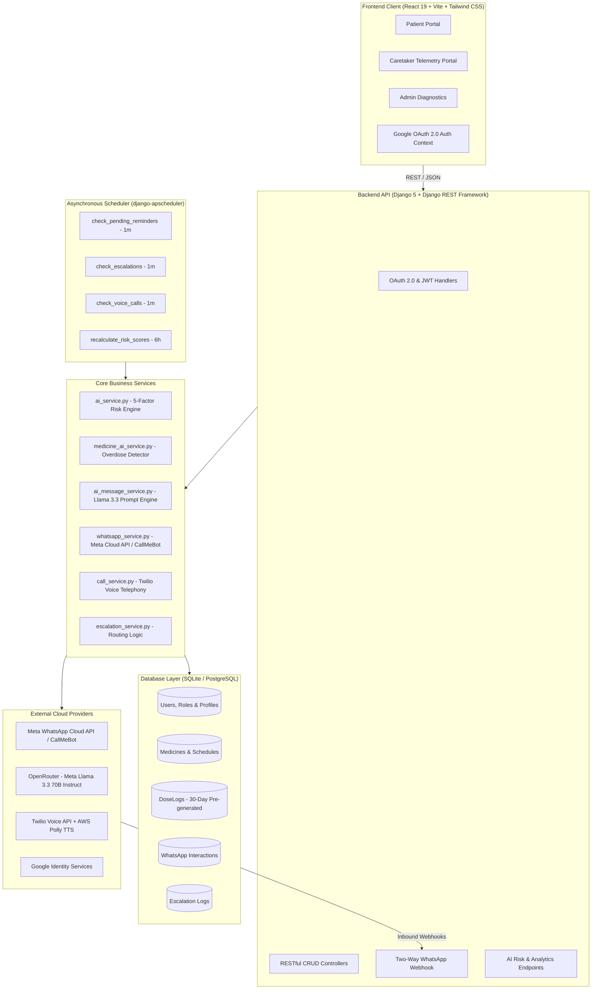

# 💊 MediMate AI

### *Intelligent, Fail-Safe Medication Adherence, AI Risk Prediction & Multi-Tier Escalation Platform*

[](https://www.python.org/)
[](https://www.djangoproject.com/)
[](https://react.dev/)
[](https://vitejs.dev/)
[](https://tailwindcss.com/)
[](https://developers.facebook.com/docs/whatsapp/)
[](https://www.twilio.com/)
[](https://openrouter.ai/)
[](LICENSE)

---

## 📌 Overview

**MediMate AI** is a patient-centric, zero-friction healthcare platform engineered to eradicate medication non-adherence among chronic illness patients—especially elderly individuals managing polypharmacy regimens (diabetes, hypertension, cardiovascular conditions).

Unlike conventional reminder applications that rely on intrusive push notifications and complex mobile apps that elderly patients routinely ignore or delete, MediMate AI operates on a **conversational healthcare model**. It brings medication reminders directly into **WhatsApp**, the communication app patients already use every single day.

Coupled with an explainable **5-Factor Deterministic Risk Engine**, an **LLM-driven Active Ingredient Overdose Checker**, and an automated **3-Tier Escalation Safety Net (WhatsApp → Caretaker Alert → Twilio Automated Voice Robocall)**, MediMate AI bridges the critical communication gap between patients, family caretakers, and clinicians.

---

## 🎯 The Healthcare Problem

* **The Adherence Epidemic:** According to the WHO, medication non-adherence averages **50%** worldwide for chronic diseases, causing avoidable hospital readmissions, acute complications, and billions in unnecessary healthcare spending.
* **The Scale in India:** Over **103 million diabetic patients** and **200+ million hypertensive individuals** face daily medication routines.
* **The Five Failure Points of Existing Apps:**
  1. **App Fatigue & Digital Illiteracy:** Complex multi-screen apps with small touch targets alienate elderly seniors.
  2. **Alert Fatigue:** Passive phone alarms are easily dismissed and forgotten within minutes.
  3. **Caretaker Information Vacuum:** Family members and adult children living away have zero visibility into whether their parents took vital doses until a medical emergency strikes.
  4. **Polypharmacy & Duplicate Active Ingredients:** Visiting multiple specialists often results in patients being prescribed different brand names for identical generic molecules (e.g., *Crocin* and *Dolo-650* both containing Paracetamol), leading to inadvertent liver toxicity.
  5. **Lack of Personal Reinforcement:** Monotonous automated beeps lack personalized encouragement, empathy, and habit-forming feedback.

---

## ✨ Key Features

```
┌─────────────────────────────────────────────────────────────────────────────────┐
│                                 MEDIMATE AI CORE                                │
├─────────────────────────┬─────────────────────────┬─────────────────────────────┤
│   Zero-Friction UX      │     Explainable AI      │   Multi-Tier Escalation     │
│  • WhatsApp Reminders   │  • 5-Factor Risk Score  │  • T+00m: WhatsApp Reminder │
│  • 1-Touch Quick Reply  │  • 7-Day Risk Forecast  │  • T+15m: Secondary Nudge   │
│  • Gamified Streaks     │  • Duplicate Drug Alert │  • T+45m: Caretaker Alert   │
│  • Dark High-Contrast UI│  • Llama 3.3 Health Tips│  • T+75m: Twilio Voice Call │
└─────────────────────────┴─────────────────────────┴─────────────────────────────┘
```

### 1. 💬 Zero-Friction Conversational WhatsApp Interface
* Reminders arrive directly via WhatsApp with zero app installation required for the patient.
* Single-character quick-action replies:
  * **`1`**: Marks the dose as taken immediately and records timestamp.
  * **`2`**: Snoozes the dose for 15 minutes.
  * **`3`**: Marks the dose as skipped, requests a reason, and instantly alerts caretakers.
* Live gamification with consecutive compliance streaks (`🔥 14-Day Streak!`).

### 2. 🛡️ 3-Tier Fail-Safe Escalation Pipeline
Unconfirmed doses never slip through the cracks:
* **T+00m:** Initial WhatsApp reminder dispatched at the scheduled dose time.
* **T+15m:** Follow-up reminder if no response is received.
* **T+45m:** Automated WhatsApp escalation sent to primary and secondary family caretakers.
* **T+75m:** Carrier-grade **Twilio automated voice robocall** dials the caretaker / emergency contact, speaking an urgent alert in Indian English (`Polly.Aditi`).

### 3. 🧠 Deterministic 5-Factor AI Risk Scoring Engine
Rather than relying on opaque "black-box" models, MediMate AI evaluates an explainable 0–100 clinical compliance risk score:
$$\text{Total Risk Score} = \min\left(100, \, F_1 + F_2 + F_3 + F_4 + F_5\right)$$

* **$F_1$ — 7-Day Recent Miss Rate (Max 50 pts):** Short-term omission frequency.
* **$F_2$ — Consecutive Missed Slots Streak (Max 20 pts):** Detects acute treatment abandonment ($\ge 3$ consecutive misses).
* **$F_3$ — Medication Regimen Complexity (Max 10 pts):** Cognitive load penalty for $\ge 4$ concurrent daily medicines.
* **$F_4$ — Day-of-Week Behavioral Pattern (Max 10 pts):** Flags historically worst compliance days (e.g., weekend lapse).
* **$F_5$ — Multi-Day Miss Streak (Max 10 pts):** Flags critical 24-hour non-compliance cycles ($\ge 2$ full days).

### 4. 🔮 7-Day Adherence Risk Forecasting
* Calculates predictive omission probabilities for every upcoming medication slot across the next week.
* Helps caretakers anticipate risky slots in advance (e.g., Sunday morning doses).

### 5. ⚠️ Duplicate Active Ingredient & Overdose Blocker
* Inspects active chemical ingredients whenever a new prescription is scheduled.
* Flags overlapping compounds (e.g., Paracetamol in Crocin vs. Dolo-650) within close dosing windows (e.g., < 2 hours) to prevent accidental toxicity.

### 6. 💡 Contextual Motivational Tip Engine
* Leverages **Meta Llama 3.3 70B Instruct** (via OpenRouter) with Hugging Face fallbacks.
* Dynamically crafts 1-line empathetic, disease-specific health insights accompanying reminders based on the patient's condition and compliance history.

### 7. 👥 Role-Based Portals & Accessibility
* **Patient Portal:** One-click Google OAuth login, circular SVG adherence ring, large tactile buttons, high-contrast dark theme engineered for seniors.
* **Caretaker Telemetry Portal:** Multi-patient monitoring, live escalation feeds, patient risk badges (`Critical`, `High`, `Medium`, `Low`), and manual diagnostic test center.
* **Admin Diagnostics:** System-wide compliance metrics, delivery audits, and WhatsApp message logs.

---

## 🏗️ System Architecture



---

## 🧰 Tech Stack

| Domain | Technology | Details |
| :--- | :--- | :--- |
| **Backend Framework** | **Django 5.0.6 & DRF 3.15.1** | Modular apps, ORM integrity, clean serializers, token authentication. |
| **Frontend Framework** | **React 19 & Vite 6** | Lightning-fast HMR, component composition, modern hooks. |
| **Styling & UI** | **Tailwind CSS 4 & Radix UI** | Modern dark glassmorphic design system, accessible primitives, Lucide icons. |
| **Task Scheduling** | **django-apscheduler 0.6.2** | Embedded in-process background runner without Celery/Redis overhead. |
| **Database** | **SQLite 3 (PostgreSQL-ready)** | ACID transactions, foreign-key cascade integrity, relational data modeling. |
| **Generative AI** | **Meta Llama 3.3 70B Instruct** | Contextual clinical health tips and active ingredient parsing via OpenRouter. |
| **Messaging** | **Meta WhatsApp Business API** | Official Cloud API / CallMeBot gateway for interactive 2-way messaging. |
| **Voice Telephony** | **Twilio Voice REST API** | Automated voice robocall dispatch with AWS Polly Indian English synthesis. |
| **Authentication** | **Google OAuth 2.0 & PyJWT** | Passwordless secure login with role-based permission routing. |

---

## 📂 Project Structure

```
medimate/
├── MediMate-AI backend/
│   ├── apps/
│   │   ├── ai/              # AI analytics, risk scoring endpoints & serialization
│   │   ├── doses/           # Dose logging, status updates, and history queries
│   │   ├── escalation/      # Escalation logging and caretaker dispatch
│   │   ├── medicines/       # Medicine catalog, active ingredients, and schedules
│   │   ├── patients/        # Patient clinical profiles, allergies & emergency contacts
│   │   ├── users/           # Custom User model, Google OAuth & RBAC
│   │   └── whatsapp/        # Meta webhook receiver, inbound parser & delivery logs
│   ├── config/              # Django root settings, WSGI/ASGI, URLs
│   ├── scheduler/           # APScheduler background tasks (reminders, escalation, calls)
│   ├── services/            # Core business logic (AI risk, WhatsApp, Twilio, Overdose detection)
│   ├── manage.py
│   ├── requirements.txt
│   └── .env.example
│
├── MediMate-AI_frontend/
│   ├── public/              # Icons and static web assets
│   ├── src/
│   │   ├── components/      # UI components (Navbar, DoseCards, Modals, RiskBars)
│   │   ├── context/         # AuthContext and state providers
│   │   ├── pages/
│   │   │   ├── admin/       # Diagnostics, delivery logs, compliance overview
│   │   │   ├── caretaker/   # Multi-patient telemetry & emergency testing console
│   │   │   └── patient/     # Dashboard, Onboarding Wizard, Dose History, AI Predictions
│   │   ├── services/        # Axios API clients & interceptors
│   │   ├── App.jsx          # Protected routing & RBAC navigation
│   │   └── main.jsx
│   ├── package.json
│   ├── tailwind.config.js
│   └── vite.config.js
│
├── MEDIMATE_AI_MASTER_DOCUMENTATION.md   # Complete technical specifications & ERDs
├── medimate_features_guide.md            # Feature walkthrough & user flows
└── README.md                             # Repository documentation
```

---

## 🚀 Getting Started

### 📋 Prerequisites
* **Python 3.10+**
* **Node.js 18+ & npm**
* **Git**

---

### 1️⃣ Backend Setup (Django REST Framework)

1. **Clone the repository:**
   ```bash
   git clone https://github.com/Raghavv1206/Medimate-AI.git
   cd Medimate-AI
   ```

2. **Navigate to the backend directory:**
   ```bash
   cd "MediMate-AI backend"
   ```

3. **Create and activate a virtual environment:**
   * **Windows (PowerShell):**
     ```powershell
     python -m venv venv
     .\venv\Scripts\Activate.ps1
     ```
   * **Linux / macOS:**
     ```bash
     python3 -m venv venv
     source venv/bin/activate
     ```

4. **Install dependencies:**
   ```bash
   pip install -r requirements.txt
   ```

5. **Configure environment variables:**
   Copy `.env.example` to `.env`:
   ```bash
   cp .env.example .env
   ```
   Configure the following parameters in `.env`:
   ```env
   DJANGO_SECRET_KEY=your-secure-random-secret-key
   DJANGO_DEBUG=True
   DJANGO_ALLOWED_HOSTS=localhost,127.0.0.1
   FRONTEND_URL=http://localhost:5173

   # Google OAuth 2.0
   GOOGLE_CLIENT_ID=your-google-client-id.apps.googleusercontent.com
   GOOGLE_CLIENT_SECRET=your-google-client-secret
   GOOGLE_REDIRECT_URI=http://localhost:8000/auth/callback/

   # WhatsApp Cloud API / CallMeBot
   WHATSAPP_ACCESS_TOKEN=your-meta-access-token
   WHATSAPP_PHONE_NUMBER_ID=your-phone-number-id
   WHATSAPP_WEBHOOK_VERIFY_TOKEN=medimate_token

   # Hugging Face / OpenRouter LLM
   HF_API_TOKEN=your-huggingface-token
   OPENROUTER_API_KEY=your-openrouter-key

   # Twilio Voice API
   TWILIO_ACCOUNT_SID=your-twilio-sid
   TWILIO_AUTH_TOKEN=your-twilio-auth-token
   TWILIO_PHONE=+1xxxxxxxxxx
   TWILIO_VOICE=Polly.Aditi
   TWILIO_LANGUAGE=en-IN
   ```

6. **Apply database migrations:**
   ```bash
   python manage.py migrate
   ```

7. **Start the backend development server & background scheduler:**
   ```bash
   python manage.py runserver
   ```
   *Backend will run at:* `http://localhost:8000`

---

### 2️⃣ Frontend Setup (React 19 + Vite)

1. **Navigate to the frontend directory:**
   ```bash
   cd ../MediMate-AI_frontend
   ```

2. **Install frontend dependencies:**
   ```bash
   npm install
   ```

3. **Configure environment variables:**
   Create a `.env` file in `MediMate-AI_frontend/`:
   ```env
   VITE_API_BASE_URL=http://localhost:8000
   VITE_GOOGLE_CLIENT_ID=your-google-client-id.apps.googleusercontent.com
   ```

4. **Launch the development server:**
   ```bash
   npm run dev
   ```
   *Frontend will run at:* `http://localhost:5173`

---

## 🧪 Live Simulation & Webhook Testing

You can simulate WhatsApp interactions locally without live Meta webhooks using PowerShell or cURL:

### Simulation 1: Patient Confirms Dose as Taken (Reply "1")
```powershell
Invoke-RestMethod -Method Post -Uri "http://localhost:8000/api/whatsapp/webhook/" -ContentType "application/json" -Body '{
  "object": "whatsapp_business_account",
  "entry": [{
    "changes": [{
      "value": {
        "messaging_product": "whatsapp",
        "messages": [{
          "from": "9876543210",
          "text": {"body": "1"}
        }]
      },
      "field": "messages"
    }]
  }]
}'
```
> **Result:** Pending dose is marked as `taken`, adherence streak increments, and confirmation is logged.

### Simulation 2: Patient Skips Dose & Triggers Escalation (Reply "3")
```powershell
Invoke-RestMethod -Method Post -Uri "http://localhost:8000/api/whatsapp/webhook/" -ContentType "application/json" -Body '{
  "object": "whatsapp_business_account",
  "entry": [{
    "changes": [{
      "value": {
        "messaging_product": "whatsapp",
        "messages": [{
          "from": "9876543210",
          "text": {"body": "3"}
        }]
      },
      "field": "messages"
    }]
  }]
}'
```
> **Result:** Dose is marked as `skipped`, and an immediate caretaker alert is queued in `EscalationLog`.

---

## 👥 The Team

MediMate AI was built during an intensive agile sprint by a dedicated multidisciplinary engineering team:

| Name | Role | Responsibilities |
| :--- | :--- | :--- |
| **Suryansh** | **Backend Engineer** | Core REST CRUD, 5-Factor Deterministic Risk Engine, Database Schema & Business Logic |
| **Raghav** | **Backend Integration** | Meta WhatsApp Cloud API, Two-Way Webhook Pipeline, Twilio Voice Telephony & OpenRouter LLM |
| **Parth** | **UI/UX Designer** | High-Contrast Design System, Elderly Accessibility & Patient Experience Design |
| **Shreyansh** | **Frontend Engineer** | React 19 Client, Dynamic Adherence Rings, Telemetry Portals & State Management |
| **Sanskar** | **Testing & QA Lead** | Edge Case Validation, Timezone Normalization, Async Retries & Quality Assurance |

---

## 🗺️ Roadmap & Scalability

- [x] **Phase 1 (Current):** Zero-friction WhatsApp reminders, 5-Factor risk score, 3-tier automated escalation, active ingredient duplicate detection.
- [ ] **Phase 2 (Near-Term):** 
  - **Hospital EHR Integration:** HL7 / FHIR API integration with hospital electronic records (Practo, Epic, Apollo).
  - **12 Indian Regional Languages:** Twilio voice calls and WhatsApp prompts translated into Hindi, Tamil, Telugu, Bengali, Marathi, etc.
  - **Voice Notes via OpenAI Whisper:** Process incoming WhatsApp audio messages for non-literate patients.
- [ ] **Phase 3 (Enterprise):** 
  - **IoT Smart Blister Packs:** Hardware cellular caps to automatically log pill dispensary events.
  - **Health Insurance APIs:** Anonymized compliance verification for insurance premium discounts.

---

## 📄 License

This project is licensed under the **MIT License** — see the [LICENSE](LICENSE) file for details.

---

<p align="center">
  <b>Built with ❤️ to protect chronic illness patients and bring peace of mind to families.</b>
</p>
