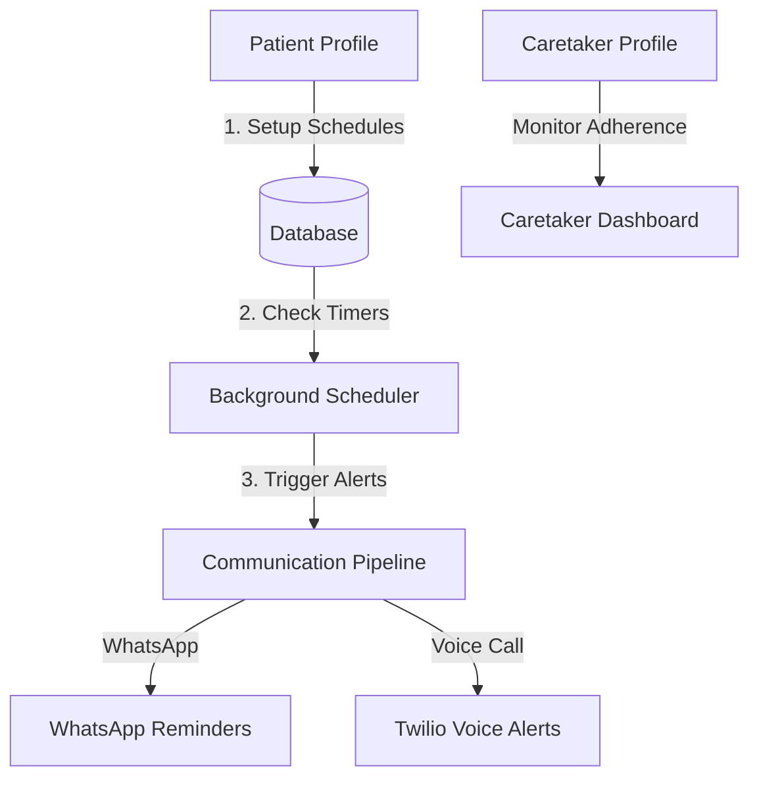

# MediMate AI — Product & Feature Guide

Welcome to the **MediMate AI** product guide. This document explains all features, workflows, scheduling mechanisms, and AI integrations in a clear, semi-non-technical manner.

---

## 🌟 1. System Overview
MediMate AI is an intelligent health assistant designed to ensure patients take their medications on time. It acts as a bridge between **Patients**, **Caretakers**, and **Emergency Contacts** by combining automated WhatsApp reminders, AI-driven risk scoring, smart drug-interaction warnings, and Twilio voice calls.

---

## 📅 2. Medication Scheduling & Smart Safety Nets

### Auto-Generated Dose Logs
When a medicine schedule is saved (e.g., "Metformin 500mg daily at 9:00 AM for 30 days"), the system automatically pre-calculates and generates individual **Dose Logs** for each occurrence. This allows the system to monitor adherence day-by-day.

### 🧠 AI Duplicate Active Ingredient Warning
To prevent accidental overdose, MediMate AI features a real-time drug checking system:
* **How it works:** When a caretaker or patient schedules a new medicine, MediMate consults an AI database to identify its **Active Ingredient** (e.g., *Paracetamol* is the active ingredient in both *Crocin* and *Dolo*).
* **The Rule:** If a user tries to schedule two medicines containing the **same active ingredient** within **2 hours** of each other, the system blocks the action and raises a warning:
  > *⚠️ "Crocin and Dolo both contain Paracetamol. Scheduling them within 2 hours may cause an accidental overdose."*
* **Override:** Users can override the warning in emergency scenarios if directed by a physician.

---

## ⏰ 3. The Smart Reminder & Escalation Timeline
If a medication is scheduled, the background system checks compliance every minute. If a patient does not log their medication, the escalation sequence begins:

```mermaid
gantt
    title Escalation Timeline (From Scheduled Time)
    dateFormat  m
    axisFormat %M min
    
    Scheduled Time : active, task1, 0, 1m
    1st WhatsApp Reminder : task2, 0, 15m
    2nd WhatsApp Follow-up : task3, 15, 45m
    Caretaker WhatsApp Alert : task4, 45, 75m
    Caretaker Twilio Voice Call : task5, 75, 90m
```

### 💬 Stage 1: Initial WhatsApp Reminder (0 Minutes Late)
* **Who receives it:** The Patient.
* **Message Content:** A greeting, medication details, an **AI-personalized health tip** (e.g., *"Take with food to prevent stomach upset"*), and their current adherence streak.
* **Interactive Options (Buttons):**
  1. **✅ Taken:** Marks the dose as taken in the system. Stops all further reminders.
  2. **⏰ Remind later:** Reschedules the reminder to trigger again in 15 minutes.
  3. **❌ Not taking (Skip):** Marks the dose as skipped, asks for a reason, and alerts the caretaker immediately.

### ⏰ Stage 2: Follow-up Reminder (15 Minutes Late)
* **Who receives it:** The Patient.
* **Message Content:** A second WhatsApp message prefixed with `⚠️ FOLLOW-UP` to grab the patient's attention.

### 🚨 Stage 3: Caretaker WhatsApp Alert (45 Minutes Late)
* **Who receives it:** The Caretaker. If the patient has multiple caretakers, the Primary Caretaker is alerted first, followed by the Secondary Caretaker. If no caretaker is assigned, it falls back to the **Emergency Phone** of the patient.
* **Message Content:** Notifies them that the patient has missed a dose and specifies the medicine and time.

### 📞 Stage 4: Twilio Voice Call (75 Minutes Late)
* **Who receives it:** The Caretaker (or Emergency Phone fallback).
* **What happens:** Twilio places an actual phone call. A Text-to-Speech voice says:
  > *"Alert from MediMate. Patient John Doe has missed their Aspirin medication scheduled for 09:00 AM. Please contact them immediately. This is an automated alert."*

---

## 🤖 4. AI Personalization & Risk Assessment

### 💡 AI Personalization Engine
Unlike generic apps, MediMate AI personalizes daily reminders based on the patient's medical profile:
* **Profile Sync:** The AI model reviews the patient's registered **chronic diseases**, **allergies**, and **conditions**.
* **Personalized Tips:** If a patient is taking *Metformin* and is diabetic, the AI generates tips like *"Be sure to check your blood sugar levels before taking this dose"* or *"Avoid drinking alcohol while on this medication"*.

### 📊 AI Risk Scoring & Analytics
Every 6 hours, the system runs an AI analysis on each patient's compliance history to calculate a **Risk Score (0 - 100)**:
* **Risk Factors Analyzed:**
  * **7-Day Miss Rate:** Percentage of doses missed in the past week.
  * **Consecutive Missed Slots:** If they missed consecutive morning/evening slots.
  * **Active Medicines:** Total number of concurrent medications (higher load increases complexity/risk).
* **Risk Categories:**
  * **🟢 Low Risk (0 - 25):** High compliance, safe behaviors.
  * **🟡 Medium Risk (26 - 50):** A few missed doses.
  * **🔴 High / Critical Risk (51+):** Frequent missed doses. Caretakers are alerted to step in and adjust care.
* **Actionable Recommendations:** The dashboard provides the caretaker with bullet points explaining *why* the patient is at risk and how to help (e.g. *"Doses are consistently missed at 8 PM, consider rescheduling to 6 PM during dinner"*).

---

## 5. Frontend Web Portal Structure & Page Breakdown
The MediMate AI front-end is divided into role-based portals (Patient, Caretaker, and Admin) and general pages.

### 🌐 General Pages (All Users)
*   **LandingPage.jsx (Home Page)**
    *   *Function:* First entry point. Features a premium design detailing hero product animations, core feature explainers, and the Google Auth log-in gateway.
    *   *Importance:* Crucial for user onboarding, branding, and directing visitors to the correct login flow.
*   **AboutPage.jsx (About Us)**
    *   *Function:* Explains the critical healthcare problem of medication non-adherence and how MediMate's AI-backed notification system acts as a safety net.
    *   *Importance:* Educates patients and families on the medical importance of adherence.
*   **ContactPage.jsx (Support)**
    *   *Function:* Form to send questions, support tickets, or feedback directly to system administrators.
    *   *Importance:* Ensures patient and caretaker support channels remain open.
*   **LoginCallback.jsx (Auth Bridge)**
    *   *Function:* Captures Google OAuth tokens from the backend redirect, saves them to client storage, and routes the authenticated user to their role-specific dashboard.
    *   *Importance:* Essential bridge for secure, passwordless authentication.

---

### 👤 Patient Portal
Provides self-management tools to build compliance habits.
*   **PatientDashboard.jsx (Home)**
    *   *Function:* Renders the primary dashboard for the patient using a premium dark-themed interface:
        *   **Medication Timeline:** Lists today's doses chronologically (indicating *Pending*, *Taken*, *Missed*, or *Skipped* states) with action buttons to mark them directly from the browser.
        *   **Streak Tracker:** A visual tracker displaying consecutive days the patient has maintained 100% medication compliance.
        *   **Compliance Score Widget:** Shows an adherence rate percentage calculated dynamically from taken vs. missed doses.
        *   **AI Adherence Alerts:** Displays notifications if the risk engine detects warning signs in recent adherence trends.
    *   *Importance:* Serves as the primary daily checklist. It removes friction by allowing patients to log their doses with a single click and encourages positive habits through streak gamification.
*   **OnboardingPage.jsx (Medical Setup)**
    *   *Function:* A structured onboarding wizard presented to patients during their first login:
        *   **Basic Demographics:** Age, Gender, and Blood Group.
        *   **Medical Baseline:** Inputting chronic conditions (e.g. Hypertension, Diabetes) and drug allergies (e.g. Penicillin).
        *   **Contact Info:** Setting up emergency phone numbers and verifying their WhatsApp number.
    *   *Importance:* Mandatory for initial account setup. It feeds the AI personalization engine (to customize daily health tips) and ensures emergency contacts are registered for fallback routing.
*   **MedicinesPage.jsx (Schedule Management)**
    *   *Function:* A medication schedule creation and management interface:
        *   **Add Schedule Modal:** Input medication name, dosage form, start/end dates, daily time slots, and frequency.
        *   **Overdose Prevention Engine:** Intercepts submission to check if the active ingredient matches any existing medicine scheduled within a 2-hour window.
        *   **List & Edit View:** Displays a card-based grid of all active, inactive, and completed medication schedules.
    *   *Importance:* The core interface where patients schedule their custom medical regimes. It acts as a safety checkpoint by preventing double-dosing of the same active drug.
*   **DoseHistory.jsx (Compliance History)**
    *   *Function:* A tabular, paginated log of every dose schedule recorded for the patient:
        *   **Status Indicators:** Color-coded badges for "Taken" (green), "Missed" (red), "Skipped" (orange), and "Pending" (blue).
        *   **Filters:** Filter by medication name, status, or date range.
        *   **Reason Logger:** Displays patient-submitted reasons for skipped doses.
    *   *Importance:* Allows patients to self-audit their long-term habits and provides a print-ready report they can share with doctors during checkups.
*   **AIPredictions.jsx (AI Risk Analysis)**
    *   *Function:* Renders the patient's personal AI analytics:
        *   **Risk Meter:** An interactive visual gauge showing their current compliance risk level (Low, Medium, High, Critical).
        *   **Risk Factors Breakdown:** Detailed reasons explaining why the score was computed (e.g., "3 morning doses missed in the last 7 days").
        *   **AI Guidance:** Practical health suggestions generated based on their adherence patterns and health baseline.
    *   *Importance:* Translates raw compliance data into clinical insights, allowing the patient to self-correct before health issues arise.
*   **EscalationLogs.jsx (Safety Audit)**
    *   *Function:* Displays a chronological feed of all automated escalation events:
        *   Logs when WhatsApp caretaker reminders were sent.
        *   Logs when Twilio voice calls were dialed, including timestamps, recipient names, phone numbers, and call status.
    *   *Importance:* Builds accountability and shows the patient exactly who in their support network gets notified if they ignore alerts.
*   **WhatsAppLog.jsx (WhatsApp Audit)**
    *   *Function:* A developer and patient view of the Meta Cloud API communication logs for that user's number.
    *   *Importance:* Helps identify if reminders are failing to reach the patient's phone due to API errors, number blockages, or invalid formatting.
*   **PatientSettings.jsx (Settings)**
    *   *Function:* Lets patients update their contact number, emergency details, and password.
    *   *Importance:* Ensures emergency contact details and notification settings are current and editable.

---

### 🏥 Caretaker Portal
Empowers health professionals and family members to monitor and respond to compliance issues.
*   **CaretakerDashboard.jsx (Home)**
    *   *Function:* A master dashboard displaying caretakers' overview:
        *   **Patient Roster Grid:** Summary cards for all assigned patients, sorted by risk level.
        *   **Urgency Alerts:** Flagging patients currently categorized under "Critical" or "High" risk.
        *   **Compliance Metrics:** Visual statistics tracking overall caretaker-level compliance rates.
    *   *Importance:* Serves as a triage tool, allowing a caretaker to immediately spot who is failing their medical regime and needs direct intervention.
*   **CaretakerPatients.jsx (Patient Directory)**
    *   *Function:* A searchable, paginated directory of patients assigned to the caretaker:
        *   Search by patient name, email, or conditions.
        *   Add/Assign Patient flow to securely link new profiles.
    *   *Importance:* Roster manager for managing caseloads.
*   **CaretakerPatientProfile.jsx (Patient Deep Dive)**
    *   *Function:* Renders patient medical history, active schedules, AI risk factors, compliance history, and the **WhatsApp & Twilio Test Control Center**.
    *   *Importance:* The most critical care management page; caretakers can analyze risk factors, adjust schedules, and manually trigger diagnostic test alerts.
*   **CaretakerEscalations.jsx (Alert Logs)**
    *   *Function:* Timed record of all alerts called or texted to the caretaker for missed patient doses.
    *   *Importance:* Serves as a historical audit of caretaker response times and actions taken.

---

### 🛡️ Admin Portal
Provides system-wide operational metrics and administrative oversight.
*   **AdminDashboard.jsx (Global Stats)**
    *   *Function:* Summarizes system-wide compliance metrics, risk breakdowns, total patients, caretakers, and active schedules.
    *   *Importance:* Gives administrators high-level oversight of platform utilization and system health.
*   **AdminUserManagement.jsx (User Directory)**
    *   *Function:* Directory of all users on the platform with features to edit roles, view details, or suspend accounts.
    *   *Importance:* Crucial for system security, user moderation, and account maintenance.
*   **AdminPatientProfile.jsx (Admin Patient Deep Dive)**
    *   *Function:* Renders complete compliance analysis and configuration tools for any patient in the system.
    *   *Importance:* Allows platform staff to assist caretakers in managing patient profiles.
*   **AdminEscalations.jsx (System-Wide Escalations)**
    *   *Function:* Central database of all SMS, WhatsApp, and Voice Call alert events across the entire platform.
    *   *Importance:* A complete operational log to audit overall system effectiveness.
*   **AdminWhatsAppLog.jsx (API Diagnostics)**
    *   *Function:* Developers' diagnostic portal for inspecting Meta Cloud API requests and webhook callbacks.
    *   *Importance:* Indispensable tool for monitoring communication pipeline health.

