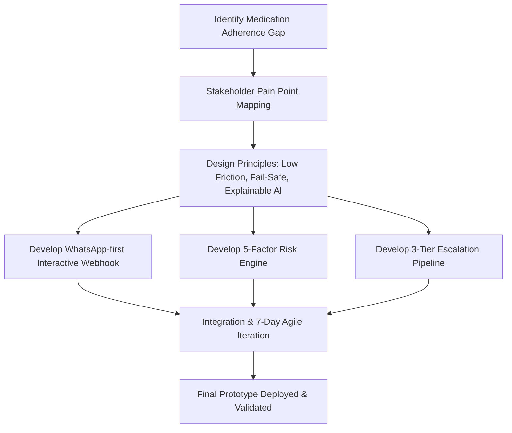
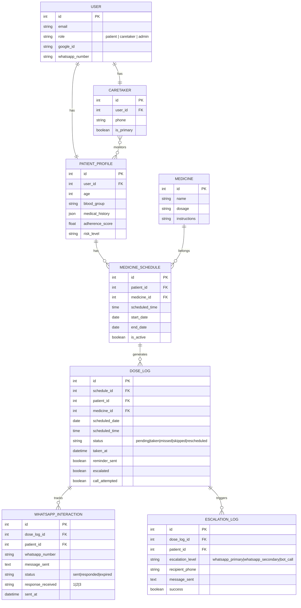
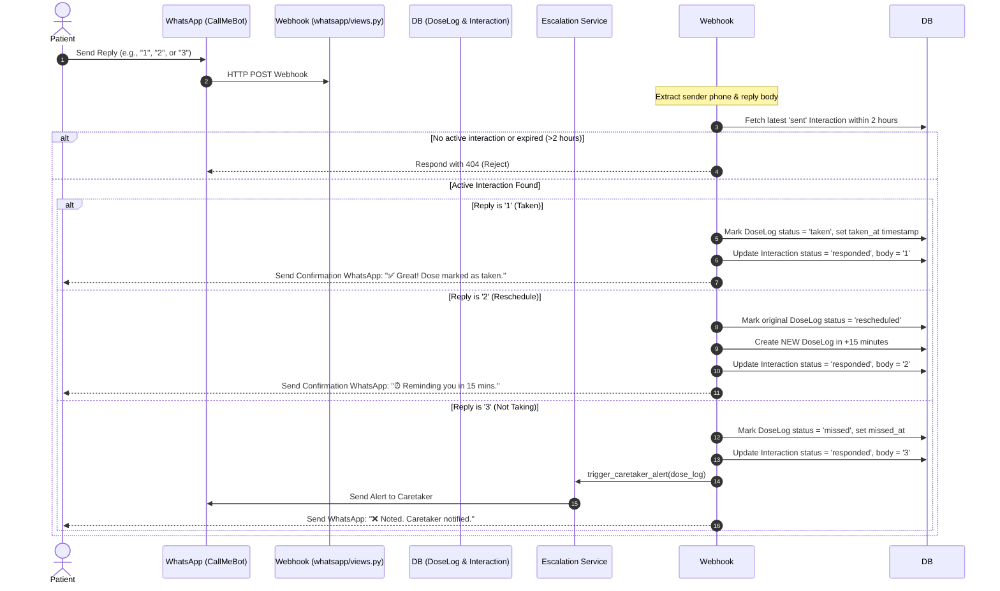

# 💊 MediMate AI — Hackathon Submission Details
## Capgemini Exceller Buildathon Grand Final Presentation Resources

This document compiles the exhaustive technical details, architecture descriptions, code workflows, design choices, and development learnings for the **MediMate AI** project. You can provide this file to Claude or copy-paste relevant sections directly into your presentation deck.

---

## 📋 Table of Contents
1. [Approach & Methodology](#1-approach--methodology)
2. [Solution Demonstration (Visual & Functional Walkthrough)](#2-solution-demonstration-visual--functional-walkthrough)
3. [Technical Architecture & Code Flow](#3-technical-architecture--code-flow)
4. [Challenges & Learnings](#4-challenges--learnings)

---

## 1. Approach & Methodology

### 🔍 The Problem-Solving Process
Medication non-adherence is a major global healthcare challenge, causing avoidable hospitalizations, disease progression, and billions in medical overhead. The team followed a human-centered design approach, mapping the friction points experienced by two key stakeholder groups:
*   **Patients**: Suffer from "alert fatigue", forgetfulness, complex multi-medicine regimens, and lack of personal motivation.
*   **Caretakers**: Suffer from anxiety regarding patient compliance, lack of real-time visibility, and delayed alerts when a patient misses a critical dose.

Our methodology focused on building an **interactive, fail-safe clinical feedback loop** that meets patients where they are—on WhatsApp—while using deterministic AI risk engines to predict compliance issues before they happen and escalates using voice call backstops when they do.



### 🛠️ Key Decisions & Assumptions
*   **WhatsApp as the Primary Interface (Meta Developer API / CallMeBot)**: Instead of assuming patients will download and keep another standalone app open, we bring reminders to WhatsApp. We chose a lightweight, API-driven gateway for rapid prototype deployment and demonstration.
*   **Explainable & Deterministic AI**: Rather than using a complex machine learning model that acts as a black box (which is risky in clinical environments), we designed a **5-factor deterministic risk prediction engine**. This guarantees that caretakers and patients can understand exactly *why* a risk level is flagged.
*   **Asynchronous Background Runner (APScheduler)**: To manage timed reminders and escalation delays, we chose `django-apscheduler` integrated directly into Django's lifecycle. This avoids the overhead of Celery, Redis, and message queues, keeping the app lightweight and deployable on free-tier hosting services (e.g., Render/Vercel) for the hackathon.
*   **3-Tier Escalation Backstop (WhatsApp → WhatsApp Caretaker → Voice Call)**: We assumed that notifications can be ignored. Therefore, if a patient misses a dose, the system escalates from a patient reminder, to a caretaker WhatsApp text, and finally to a simulated or real Twilio automated voice call to the caretaker's phone at T+75 minutes.
*   **LLM Integration via OpenRouter**: We integrated OpenRouter to tap into high-performance foundation models, specifically selecting **Meta Llama 3.3 70B Instruct** to generate highly personalized, context-aware motivational health tips for patients based on their current compliance patterns and risk score.

### 📅 7-Day Sprint Walkthrough
We organized development using a strict daily agile milestone tracker:
*   **Day 1 (Foundation)**: Initialized Django REST API backend, SQLite DB models, custom User/RBAC permissions, Google OAuth 2.0 integration, and the React + Vite + Tailwind frontend design system.
*   **Day 2 (Onboarding & Schedules)**: Built the patient/caretaker profiles, a multi-step onboarding wizard UI, and the medicine/schedule database models with automated `post_save` signals that pre-generate 30 days of dose logs.
*   **Day 3 (WhatsApp Gateway & AI Tips)**: Integrated CallMeBot HTTP dispatch and connected OpenRouter (Meta Llama 3.3 70B Instruct) to append personalized, motivational clinical insights to reminder cards.
*   **Day 4 (Interactive Webhooks)**: Coded the webhook reply handler to process incoming WhatsApp responses (`1` = Taken, `2` = Reschedule, `3` = Refused/Escalate) and handle reschedule logic (+15 mins) and instant alerts.
*   **Day 5 (Background Jobs & Risk Engine)**: Programmed APScheduler to monitor overdue doses and built the 5-factor patient risk scoring engine and weekly compliance analytics.
*   **Day 6 (Caretaker & Admin Portals)**: Built the caretaker dashboard with patient health stats, live escalation logs feed, admin system overview dashboard, and integrated Twilio Voice API for auto-dial alerts.
*   **Day 7 (Validation & Launch)**: Loaded mock clinical demonstration profiles, tested end-to-end webhook routes, and deployed the frontend to Vercel and backend to Render.

---

## 2. Solution Demonstration (Visual & Functional Walkthrough)

> [!NOTE]
> *Presenter Tip: When presenting this slide, walk the judges through a day in the life of a patient using the sequence below. Insert high-resolution screenshots of the UI at each step.*

### 🎭 End-to-End User Journeys

#### 1️⃣ Onboarding & Login
*   **Visual Elements**: Dark-themed, neon-cyan clinical landing page. Users click **"Continue with Google"**, which triggers a secure OAuth 2.0 flow, retrieves their name/avatar, and redirects them to a 4-Step Patient Onboarding Wizard (Personal Details → Medical History → WhatsApp Number → Emergency Contacts).
*   **Key Outcome**: The database stores medical history (disease tags, allergies) and marks the user profile's `onboarding_done` flag.

#### 2️⃣ Daily Patient Dashboard
*   **Visual Elements**: Animated circular adherence progress ring (color-shifting from Green for high compliance, Amber for moderate, Red for low). The dashboard lists today's doses in card layout sorted by time.
*   **Status Indicators**: Dose cards are color-coded:
    *   `green`: Dose Taken (complete with timestamp).
    *   `amber`: Due Soon (active, awaits action).
    *   `red`: Overdue / Missed.
    *   `cyan`: Upcoming (scheduled for later).

#### 3️⃣ Asynchronous WhatsApp Reminders & Interactive Webhook
*   **Interactive Flow**: 
    1.  At scheduled dose time, the patient receives a WhatsApp message from the MediMate bot containing their name, medicine, dosage, AI-generated motivational tip, and streak counter.
    2.  The message prompts: *"Reply 1 to Take, 2 to Reschedule 15 mins, 3 to Refuse."*
    3.  **Patient replies `1`**: Webhook receives payload → marks `DoseLog` as taken → WhatsApp sends: *"✅ Great! Dose marked as taken. Keep it up!"*
    4.  **Patient replies `2`**: Webhook creates a new `DoseLog` entry scheduled 15 minutes in the future, marking the original as rescheduled.
    5.  **Patient replies `3`**: Webhook marks dose as missed, logs refusal reason, and immediately triggers an alert to the caretaker's WhatsApp.

#### 4️⃣ 3-Tier Escalation Pipeline in Action
*   **T+30 Minutes**: Patient hasn't replied to the dashboard or WhatsApp. APScheduler checks, sees status is `pending` and `reminder_sent=False`, and sends a secondary WhatsApp reminder.
*   **T+45 Minutes**: Patient still hasn't taken the dose. APScheduler flags the dose, determines caretaker assignments, and sends a WhatsApp alert to the primary caretaker: *"🚨 MediMate ALERT: Patient [Name] has missed [Medicine]. Please check on them immediately."* (If no caretaker, it falls back to the emergency contact).
*   **T+75 Minutes**: Dose remains missed. APScheduler triggers the Twilio Voice service. The system calls the caretaker's phone directly and reads an automated text-to-speech message: *"Alert from MediMate. Patient [Name] has missed their medication... Please contact them."*

#### 5️⃣ AI Risk Predictions Screen
*   **Visual Elements**: A dedicated dashboard screen showing the patient's overall AI risk rating out of 100, a visual progress-bar breakdown of the 5 risk factors, and a **7-Day Risk Forecast Grid** predicting which upcoming medication slots are at highest risk of omission.

#### 6️⃣ Caretaker and Admin Dashboards
*   **Caretaker Portal**: Monitors assigned patients, displaying compliance levels, active prescription counts, patient risk badges (`critical`, `high`, `medium`, `low`), and a scrolling live feed of escalation events.
*   **Admin Panel**: Displays global telemetry (overall compliance rates, total dose logs, user management, and detailed WhatsApp logging grids).

---

## 3. Technical Architecture & Code Flow

### 🎨 Visual Architecture Diagram

Below are the technical architecture mappings of the MediMate AI platform. Choose the orientation that fits your PowerPoint slide layout best:

#### Option A: Landscape Layout (Padded to 9:16)


#### Option B: Full-Bleed Vertical Layout with Lifeline (True 9:16 - No Padding)


---

### 📂 High-Level Project Structure

The project is structured as a decoupled web application: a Django REST API server handles all models, triggers, and external integrations, while a React + Tailwind CSS client provides the user interface.

```
medimate/
├── MediMate-AI backend/            # Django 5 Application
│   ├── config/                     # Django core configurations (settings, routes)
│   ├── apps/                       # Modularized business apps
│   │   ├── users/                  # Custom User model, Google OAuth, RBAC
│   │   ├── patients/               # PatientProfile, Caretaker assignments
│   │   ├── medicines/              # Medicine model, schedules, generation signals
│   │   ├── doses/                  # Daily DoseLog tracker models
│   │   ├── whatsapp/               # WhatsAppInteraction models & Webhook API
│   │   ├── ai/                     # AI risk logic views and predictions
│   │   └── escalation/             # Escalation log auditing
│   ├── services/                   # Business Logic Layer (Interactions & Gateways)
│   │   ├── ai_service.py           # 5-factor Risk Engine & 7-day Forecaster
│   │   ├── ai_message_service.py   # LLM prompt configuration & motivational tip generator
│   │   ├── whatsapp_service.py     # CallMeBot HTTP gateway handler
│   │   ├── escalation_service.py   # Caretaker notification router & fallback logic
│   │   └── call_service.py         # Twilio Voice API integration
│   ├── scheduler/
│   │   └── jobs.py                 # APScheduler background tasks (overdue & alerts)
│   └── manage.py
│
└── MediMate-AI_frontend/           # React 19 Client
    ├── public/                     # Assets & icons
    ├── src/
    │   ├── context/
    │   │   └── AuthContext.jsx     # Global JWT State & Axios HTTP interceptors
    │   ├── components/             # Reusable UI widgets & layout sidebars
    │   └── pages/                  # Route views (Landing, Patient, Admin, Caretaker)
```

---

### 🗄️ Database Schema & Relationships



---

### ⚙️ Core Service Implementation Breakdown

#### 1. The 5-Factor Risk Scoring Engine (`services/ai_service.py`)
This engine evaluates five distinct behavioral and regimen parameters to output a clinical risk score between `0` and `100`:
1.  **Recent Miss Rate (Last 7 Days) — *Weight: 50%***: Counts all missed/skipped doses against total scheduled doses in the last week.
2.  **Consecutive Missed Slots — *Weight: 20%***: Checks if the patient has missed multiple consecutive slots, flagging rapid regression.
3.  **Medication regimen complexity — *Weight: 10%***: Patients with 4 or more active daily medicine schedules receive a complexity penalty.
4.  **Day-of-Week Pattern — *Weight: 10%***: Analyzes historical miss trends. If the patient has a statistical history of missing doses on a specific day of the week (e.g. Sundays), and today is that day, the risk is elevated.
5.  **Consecutive Missed Days — *Weight: 10%***: Adds risk weight if there has been a multi-day streak of medication omission.

The final score maps directly to clinical risk levels:
*   **Low** (<25): 🟢 *"You're doing great! Keep up the consistency."*
*   **Medium** (25–49): 🟡 *"Some doses were missed recently. Let's get back on track!"*
*   **High** (50–74): 🟠 *"Multiple missed doses detected. Your health needs attention!"*
*   **Critical** (75+): 🔴 *"Urgent: High risk of medication non-adherence. Please take action!"*

#### 2. The 7-Day Dose Predictor (`services/ai_service.py`)
This algorithm forecasts future adherence risk for specific doses. It calculates the historical miss rate for *each specific medicine* over the last 30 days, then combines it with the patient's global risk score using a weighted probability:
$$\text{Risk Probability} = (0.4 \times \text{Base Risk}) + (0.6 \times \text{Medicine Miss Rate})$$
It maps upcoming doses across the next 7 days and outputs sorted cards representing the highest-risk medication events.

#### 3. AI-Personalized Messages via Meta Llama 3.3 (`services/ai_message_service.py`)
Every WhatsApp reminder dynamically generates parameters before dispatch. It constructs a prompt containing:
*   The patient's name, medicine name, dosage, and scheduled time.
*   The current adherence streak counter (representing consecutive days where all scheduled doses are marked `taken`).
*   A customized prompt sent to **Meta Llama 3.3 70B Instruct** via OpenRouter's HTTP endpoint:
    `https://openrouter.ai/api/v1/chat/completions` with model set to `meta-llama/llama-3.3-70b-instruct`.
*   The model returns a highly tailored, encouraging clinical motivational tip that is injected directly into the WhatsApp interactive template. A local list of static fallback tips is used if OpenRouter is unreachable or returns a timeout.

---

### 🔄 WhatsApp Webhook Flow & Code Execution



---

## 4. Challenges & Learnings

During the development of the MediMate AI prototype, the team overcame several technical challenges:

### ⏱️ 1. Asynchronous Background Scheduling in a Django App
*   **The Challenge**: Reminder schedules, late notifications (T+30), caretaker WhatsApp alerts (T+45), and Twilio phone calls (T+75) require an active background queue. Running standard task runners like Celery requires external process management and a Redis broker, which is complex to set up and deploy quickly on free-tier services.
*   **The Solution**: We integrated `django-apscheduler`. It runs inside the Django WSGI thread pool, uses the active SQLite database as a persistent job store, and executes check loops every 60 seconds without needing separate processes. We initialized it safely in the `ready()` hook of the Django app config.

### 🔗 2. Webhook Phone Number Matching & Session Expiry
*   **The Challenge**: Inbound WhatsApp webhooks from CallMeBot provide the sender's phone number, but international prefixes vary (some have `+`, some have country codes like `91`, others don't). In addition, if a patient replies to a message sent two days ago, it shouldn't overwrite today's logs.
*   **The Solution**:
    *   *Partial Matching*: We implemented a database query filter that matches the last 10 digits (`whatsapp_number__endswith=sender_phone[-10:]`). This ensures matching succeeds regardless of country prefixes.
    *   *Session Window*: We enforce a 2-hour sliding window (`sent_at__gte=two_hours_ago`). If a reply is received after 2 hours, it is classified as expired, keeping data logs accurate.

### 🤖 3. LLM API Latency & Fail-Safe Fallbacks
*   **The Challenge**: Querying OpenRouter for Meta Llama 3.3 70B Instruct outputs inside a background job can introduce API latency or network timeouts, which could block or delay the background scheduler.
*   **The Solution**: We isolated the OpenRouter HTTP request with a strict 5-second connection timeout. If the request fails, times out, or the API returns an empty payload, the code immediately catches the exception and pulls a motivational message from a local pre-compiled list. This guarantees that notifications are always sent on time.

### 🌐 4. Timezone Management in SQLite
*   **The Challenge**: Database logs require timezone-aware timestamps (UTC), but medicine schedules are set in local clock time (e.g. *8:00 AM*). Comparing UTC database timestamps with local time fields can lead to reminders firing early or late.
*   **The Solution**: We decoupled schedules and logs. While the `MedicineSchedule` stores standard `TimeField` local times, the `DoseLog` stores local dates (`scheduled_date`) and local times (`scheduled_time`). The background cron job queries the SQLite database using timezone-aware local date offsets to ensure matching is precise.
